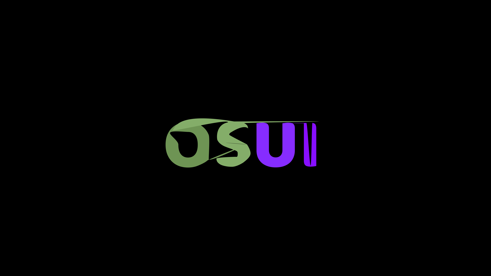

<h1 align="center">
  
</h1>

# OSUI 2.0 Coming Soon

## OSUI 2.0 based on? 

- Electron

OSUI stands for Operating System User Interface. It is a core of the Smith-Pad ecosystem,
offering a refined and accessible interface experience for para-professionals, teachers,
and students with intellectual and developmental disabilities (IDD).

## Running Dockerfiles