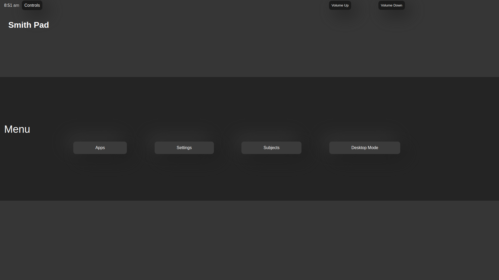
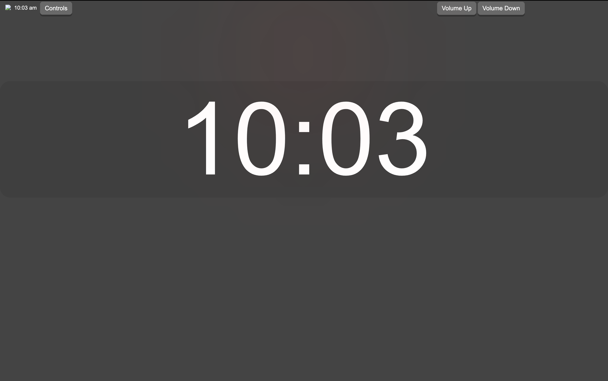

</img>

<h1 align="center">Operating System User Interface </h1>

<h2 align="center">What is it?</h2>

OSUI is the core user interface for the Smith-Pad ecosystem, enpowering teachers, paraprofessionals
and students to use a simple, elegant approach to interfacing with the UI.

<h2 align="center">What is the benefit of it</h2>

<li> It just works </li>

<li> No technical difficulties </li>

 <li> Allow students to get work done </li>

<li> Allows teachers to prevent any technical difficulties </li> 

<h2 align="center">Home-Screen</h2>

<h2 align="center">Clock Mode</h2>

<h2 align="center">Dependency Install</h2>

In this section, we are going to be talking about installation 
of dependencies to make OSUI run properly

