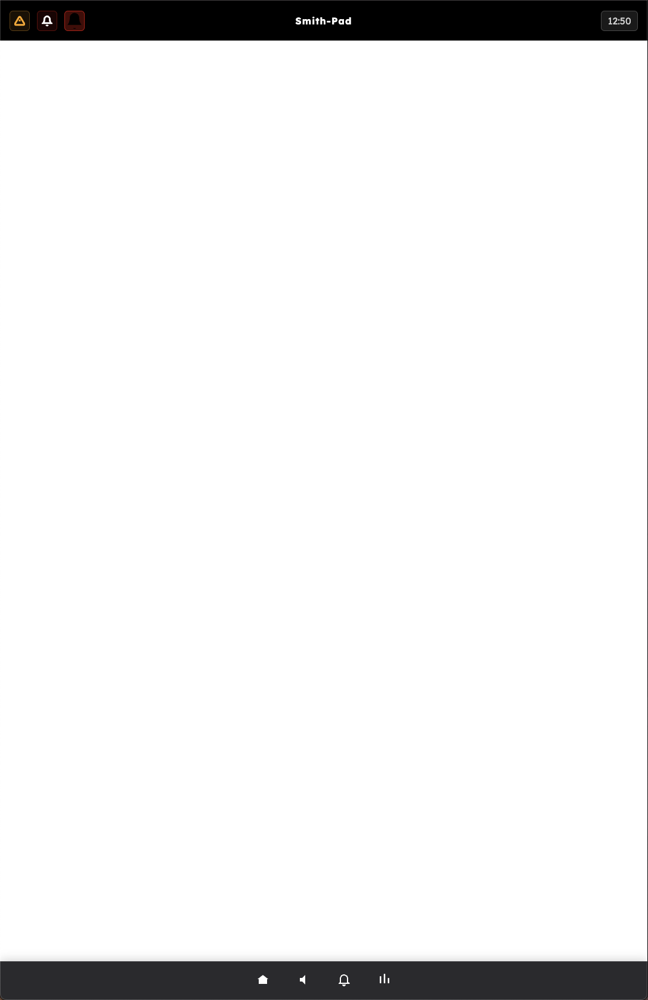

# OSUI Beta


<center>  </center>

## What the OSUI beta is based on?

- Electron
        - [https://www.electronjs.org/]

## File Structure

```shell

```


# UI UX

## Global Navigation Bar Vari-1


### Home Icon
Takes the user to the main home screen.

### Audio Icon
Makes a popup of elements: 

- Audio Volume
- Media Currently Playing


### Notification Icon
This allows the ability to see notifications 