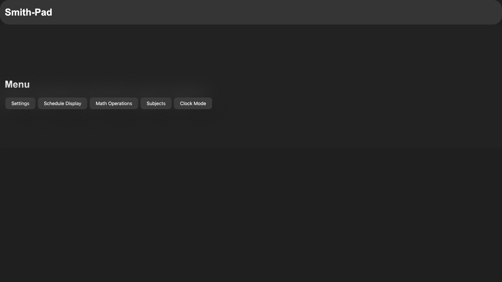

</img>

<h1 align="center">Operating System User Interface </h1>

<h2 align="center">What is it?</h2>

OSUI is the core user interface for the Smith-Pad ecosystem, enpowering teachers, paraprofessionals
and students to use a simple, elegant approach to interfacing with the UI.

# What's New

- Dynamic File Editing (header.h)
    - This allows more easier maintainability for the source code of OSUI. (Releasing Soon...)

# TODO:

- Make ClockMode Function in main.c [In Progress]